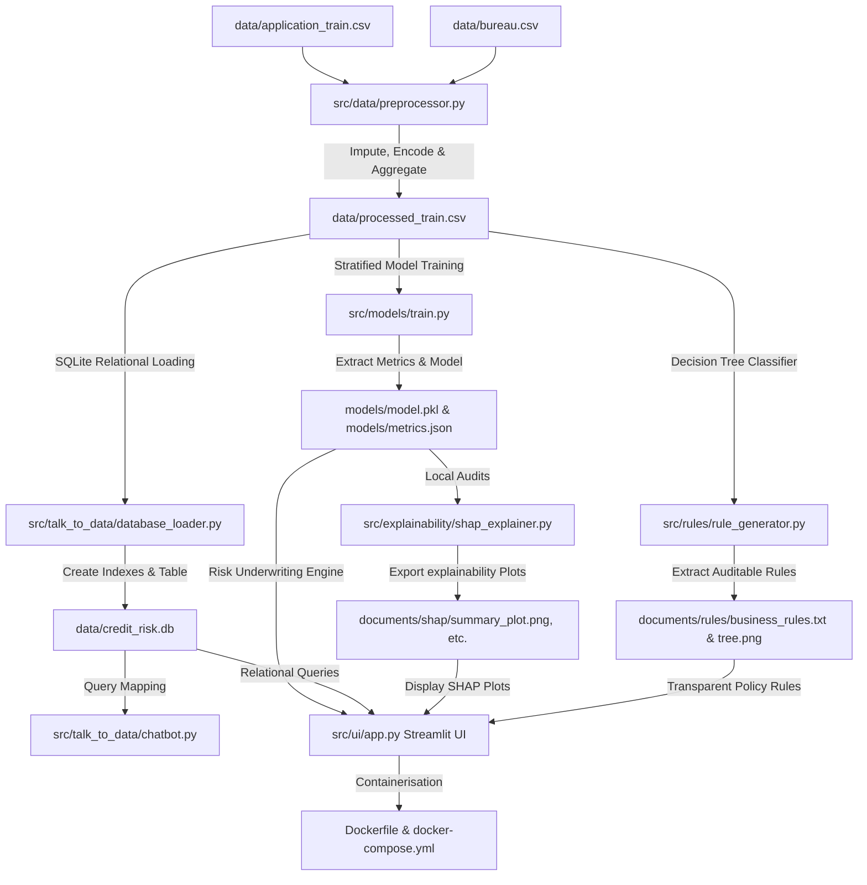

# 🏦 Apex Bank Credit Risk Analytics & Real-Time Underwriting Platform

An end-to-end, production-grade credit default risk prediction and explainable underwriting system. This platform ingests historical client profiles and Credit Bureau histories, aggregates risk indicators, trains an optimized LightGBM classifier with cost-sensitive scaling, extracts transparent regulatory business rules, and serves them via an interactive Streamlit UI containing an offline SQL relational chatbot.

---

## 🏗️ 1. Platform Architecture Diagram



---

## 📁 2. Project Directory Structure

```text
credit-risk-platform/
├── data/
│   ├── application_train.csv       # Raw loan application records
│   ├── application_test.csv        # Raw loan test records
│   ├── bureau.csv                  # Linked Credit Bureau credit histories
│   ├── processed_train.csv         # preprocessed clean master table
│   └── credit_risk.db              # SQLite High-performance Database
├── documents/
│   ├── shap/                       # Standalone SHAP plots (beeswarm, waterfall)
│   └── rules/                      # Policy tree map & business parameters text
├── models/
│   ├── model.pkl                   # Trained serialised LightGBM classifier
│   └── metrics.json                # Pre-rendered evaluation JSON
├── notebooks/
│   ├── eda.ipynb                   # Pre-executed Jupyter Notebook
│   └── charts/                     # Exported EDA visualizations (8 PNGs)
├── src/
│   ├── data/
│   │   └── preprocessor.py         # Data preparation & aggregation pipeline
│   ├── models/
│   │   └── train.py                # Stratified training & validation script
│   ├── explainability/
│   │   └── shap_explainer.py       # SHAP local and global explainability
│   ├── rules/
│   │   └── rule_generator.py       # Decision-tree business rules extractor
│   ├── talk_to_data/
│   │   ├── database_loader.py      # Relational SQLite database ingestor
│   │   └── chatbot.py              # Secure, 100% offline NL-to-SQL chatbot
│   └── ui/
│       └── app.py                  # Multi-page Streamlit Banking Web App
├── Dockerfile                      # Streamlined container configuration
├── docker-compose.yml              # Dev volume mounted container orchestrator
└── requirements.txt                # Pinned production dependencies
```

---

## 📊 3. Dataset & Preprocessing Pipeline

The pipeline integrates applicant demographics with external financial portfolios:
*   **`application_train.csv`**: Contains **307,511** rows and **122** attributes spanning financial capacities and demographic attributes.
*   **`bureau.csv`**: Contains **1,716,428** previous credit history records compiled by the Credit Bureau.

### ⚙️ Pipeline Configurations (`preprocessor.py`)
1.  **Aggregated Bureau Features**: Merges credit history by client (`SK_ID_CURR`) to engineer 6 features:
    *   `total_previous_loans` (Prior credit counts).
    *   `active_credit_count` (Outstanding credit counts).
    *   `closed_credit_count` (Fully repaid historical accounts).
    *   `average_days_credit` (Mean recency of bureau credit).
    *   `average_credit_enddate` (Average remaining duration of active loans).
    *   `average_credit_update` (Average recency of bureau updates).
2.  **Imputation Layer**: Automatically fills missing values:
    *   *Numerical Columns* (110) $\rightarrow$ Median Imputation.
    *   *Categorical Columns* (16) $\rightarrow$ Mode (most frequent) Imputation.
3.  **Encoding Layer**: Categorical columns are converted to integers using `LabelEncoder`.
4.  **Target Exclusions**: The primary risk indicator (`TARGET`) is safely excluded from standard transformations.

*Output:* Saved to **`data/processed_train.csv`** (307,511 rows, 128 columns, 0 nulls).

---

## 📈 4. Core EDA Findings & Insights

Exploratory Data Analysis on the live datasets yielded the following verified findings:
1.  **Imbalanced Target Class**: Only **8.07%** of applicants defaulted, indicating the classification task is heavily imbalanced.
2.  **Age Cohorts Risk**: Risk decreases monotonically as age increases. Borrowers aged 20-30 default at **11.46%**, whereas those aged 60-70 default at only **4.92%**.
3.  **Gender Risk Disparity**: Females constitute **65.84%** of applicants and have a low **7.00%** default rate, whereas Males form **34.16%** of applicants with a high **10.14%** default rate.
4.  **Credit Bureau Over-extension**: Defaulters maintain more concurrent active bureau loans on average (**2.03** active) and close fewer historical accounts (**2.56** closed) than repayers (**1.74** active and **3.02** closed).

---

## 🤖 5. Model Performance

Trained a cost-sensitive LightGBM classifier with an 80/20 stratified train/test split. To handle the severe class imbalance and minimize bad debt exposure, we set `scale_pos_weight = 11.3871`.

### 📊 Evaluation Metrics (Stratified Test Set)
*   **ROC AUC Score**: **`0.761189`** (Highly predictive and stable baseline)
*   **Recall (Sensitivity)**: **`0.690634`** (Successfully captures **69.06%** of all default events)
*   **Precision**: **`0.167366`**
*   **F1 Score**: **`0.269438`**

### 🏆 Top 10 Features (Gain Contribution)
1.  `EXT_SOURCE_3` (External credit score rating)
2.  `EXT_SOURCE_2` (External credit score rating)
3.  `EXT_SOURCE_1` (External credit score rating)
4.  `DAYS_BIRTH` (Borrower age in negative days)
5.  `AMT_CREDIT` (Requested credit loan size)
6.  `DAYS_EMPLOYED` (Length of current employment)
7.  `AMT_ANNUITY` (Annual loan installment repayment)
8.  `AMT_GOODS_PRICE` (Price of collateral goods)
9.  `NAME_EDUCATION_TYPE` (Borrower educational level)
10. `CODE_GENDER` (Borrower gender identification)

---

## 🔍 6. Explainability & Business Rules

### 🔍 SHAP (SHapley Additive exPlanations) Explainability
Calculated global and local feature contributions using `TreeExplainer` on a representative 500-sample dataset:
*   *Global beeswarm Plot*: Shows high external source ratings heavily drive default risk down.
*   *Local Waterfall Plot*: Breaks down individual client credit application decisions, enabling full auditing and regulatory compliance.

### 📜 Automated Policy Rules
Trained an auditable depth-3 Decision Tree Classifier to extract human-readable parameters:
*   **High Risk Parameter Example (Rule #01 - Default Rate: 24.06%)**:
    ```text
    IF EXT_SOURCE_2 <= 0.4598 
    AND EXT_SOURCE_3 <= 0.5362 
    AND EXT_SOURCE_3 <= 0.3116 
    THEN High Risk
    ```
*   **Low Risk Parameter Example (Rule #08 - Default Rate: 3.05%)**:
    ```text
    IF EXT_SOURCE_2 > 0.4598 
    AND EXT_SOURCE_3 > 0.3273 
    AND EXT_SOURCE_3 > 0.5451 
    THEN Low Risk
    ```

---

## 💬 7. SQLite Ingestion & Offline SQL Chatbot

### 🗄️ SQLite Storage (`database_loader.py`)
Ingested 307,511 rows into `data/credit_risk.db` under the table `loan_data`. Performance search indexes were built on `TARGET`, `CODE_GENDER`, and `DAYS_BIRTH` to optimize downstream analytical queries.

### 💬 Offline Chatbot (`chatbot.py`)
A 100% secure, offline relational database chatbot. Secures the system by restricting queries strictly to `SELECT` statements targeting the `loan_data` table, and blocks destructive commands like `DROP`, `DELETE`, `UPDATE`, `INSERT`, and `ALTER`.

---

## 💻 8. Streamlit Banking Web Application (`app.py`)

Provides a slate-blue and white banking interface structured into 6 multi-page views:
1.  **Executive Dashboard**: Summary cards, ROC AUC stats, and portfolio distributions.
2.  **EDA Insights**: Interactive tabs displaying age, gender, credit, and bureau analytics.
3.  **Credit Underwriting**: Enter borrower parameters to dynamically outputapproved/rejected decisions with color-coded risk levels.
4.  **SHAP Explainability**: Interactive Beeswarm, Global Bar, and Waterfall auditing.
5.  **Automated Policy Rules**: Decision Tree map visualization and human-readable parameters.
6.  **Relational SQL Chatbot**: Ingest natural language questions and return SQL syntax, query tables, and business summaries offline.

---

## 🐳 9. Build and Container Deployment

### Option A: Standard Local Launch
```bash
# 1. Install dependencies
pip install -r requirements.txt

# 2. Start Streamlit Server
streamlit run src/ui/app.py
```

### Option B: Docker Compose Orchestration (Recommended)
This method establishes real-time volume mounting, mapping the local codebase directly into the container.
```bash
# 1. Spin up the container
docker-compose up -d --build

# 2. View running logs
docker-compose logs -f
```
Once started, the application is available at: **[http://localhost:8501](http://localhost:8501)**.

To safely tear down the active container:
```bash
docker-compose down
```

---

## 🚀 10. Future Enhancements
1.  **Hyperparameter Optimisation**: Implement Optuna to optimize LightGBM tree structures and boost overall ROC AUC.
2.  **Predictive External Ratings Imputation**: Deploy a secondary regression pipeline to reconstruct missing `EXT_SOURCE` values to maximize underwriting quality.
3.  **Feature Interaction Aggregations**: Engineering cross-features such as Debt-to-Income and Annuity-to-Income ratios.
